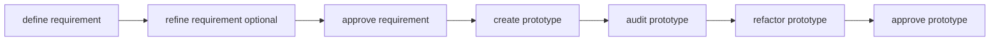

# Iterative Development

## 1. Main Loop

NVST uses one opinionated development loop:

`Define/Refine/Approve Requirement → Create Prototype → Audit Prototype → Refactor Prototype → Approve Prototype`

The loop is executed with these commands, in order:

1. `bun nvst define requirement --agent <provider>`
2. `bun nvst refine requirement --agent <provider> [--challenge]` (optional, repeatable)
3. `bun nvst approve requirement`
4. `bun nvst create prototype --agent <provider> [--iterations <N>] [--retry-on-fail <N>] [--stop-on-critical]`
5. `bun nvst audit prototype --agent <provider>`
6. `bun nvst refactor prototype --agent <provider>`
7. `bun nvst approve prototype`


```mermaid
flowchart LR
  A[define requirement] --> B[refine requirement optional]
  B --> C[approve requirement]
  C --> D[create prototype]
  D --> E[audit prototype]
  E --> F[refactor prototype]
  F --> G[approve prototype]
```

## 2. Command Scope

Public CLI command groups relevant to the workflow are:

- `define requirement`
- `refine requirement`
- `approve requirement`
- `create prototype`
- `audit prototype`
- `refactor prototype`
- `approve prototype`

Utility commands that are still part of the CLI:

- `init`
- `destroy`
- `write-json`

## 3. Typical Iteration Example

```bash
bun nvst define requirement --agent codex
bun nvst refine requirement --agent codex --challenge
bun nvst approve requirement
bun nvst create prototype --agent codex --iterations 10
bun nvst audit prototype --agent codex
bun nvst refactor prototype --agent codex
bun nvst approve prototype
```

This example is the canonical order for a normal iteration.
