# Iterative Development

## 1. Abstract Idea

Approach: requirements-driven development.

**Cycle:** Define → Prototype → Refactor

**Stages:**

- **Define** — Requirements are defined. Outcome: agreed and documented requirement.
- **Prototype** — A prototype is created, tested, corrected, and approved or discarded. Outcome: working, tested prototype.
- **Refactor** — The prototype is cleaned up and integrated into the final product. Outcome: integrated code, updated project context, change log.

**Context documents (only two):**

- **Entry point** — The agent has a single entry document: what the repo is, how to work here, the process (Define → Prototype → Refactor), and the reference to project context.
- **Project context** — A single document with conventions (clean code, stack, patterns) and product architecture (modules, structure). The agent adheres to this document from the second iteration onward.

**Flow:** Each iteration has a consecutive identifier. Define produces the documented requirement; Prototype consumes it and produces the tested prototype (and the iteration’s test plan); Refactor consumes that, updates project context, runs refactorings, and records changes. When the iteration is closed, iteration artifacts are archived or removed.

**Assumptions:** An entry document for the agent exists. Global conventions (clean design, clean code, recommended stack, etc.) are defined in advance by the user and live in the project context document.

```mermaid
flowchart LR
    Start(["▶ start iteration"]) --> Define

    subgraph Define["🔍 Define"]
        direction TB
        DA["define requirement"] --> DB["refine requirement\n(optional × N)"]
        DB --> DC["approve requirement"]
        DC --> DD["create PRD.json"]
    end

    subgraph Prototype["🛠 Prototype"]
        direction TB
        PA["create / approve\nproject-context"] --> PB["create prototype\n(Ralph loop)"]
        PB --> PC["define + approve\ntest-plan"]
        PC --> PD["execute test-plan"]
        PD --> PE{all pass?}
        PE -- No --> PF["fix bugs"]
        PF --> PD
        PE -- Yes --> PG["approve prototype"]
    end

    subgraph Refactor["♻ Refactor"]
        direction TB
        RA["define refactor-plan\n(evaluate + plan)"] --> RB["approve refactor-plan\n→ TECHNICAL_DEBT.md"]
        RB --> RC["create prd --refactor"]
        RC --> RD["execute refactor\n(Ralph loop)"]
        RD --> RE["run all tests"]
        RE --> RF{pass?}
        RF -- No --> RG["fix bugs"]
        RG --> RE
        RF -- Yes --> RH["update PROJECT_CONTEXT.md\n+ register CHANGELOG.md"]
    end

    Define --> Prototype
    Prototype --> Refactor
    Refactor --> Start
```

---

## 2. Implementation

Summary: **Start:** `bun nvst start iteration` (archives previous iteration if it exists, initializes state for the new one). Then **Define** → **Prototype** → **Refactor** (evaluate + plan → approve → PRD refactor → execute refactor → full tests → CHANGELOG). For the next iteration, run `bun nvst start iteration` again.

### 2.1 State Management

- **Directory structure (by contract):**
  - **AGENTS.md** — At repo root. Entry point for the agent.
  - **.agents/** — Root of process resources.
    - **PROJECT_CONTEXT.md** — Project conventions and architecture.
    - **state.json** — State of the current iteration (see fields below).
    - **skills/** — Skills used by commands (create-pr-document, refine-pr-document, create-project-context, etc.).
    - **flow/** — Flow of the current iteration.
      - Iteration files: all artifacts it_{current_iteration}_* (it_000001_product-requirement-document.md, it_000001_PRD.json, it_000001_progress.json, etc.) live here.
      - **archived/** — Closed iterations. Each iteration is stored in a subfolder by number (e.g. `archived/000001/`, `archived/000002/`). When running `bun nvst start iteration`, the it_{prev}_* files in `.agents/flow/` are moved to `.agents/flow/archived/<prev>/`.

- **state.json** — State file for the current iteration. Location: `.agents/state.json`. Commands read it to get the *it* prefix and current phase; they update it as they advance. Fields:

  - **current_iteration**: string, exactly 6 digits (e.g. "000001", "000042"). Iteration identifier. The file name prefix is `it_` + this value (e.g. it_000042_product-requirement-document.md).
  - **current_phase**: "define" | "prototype" | "refactor". Current phase of the cycle.
  - **phases**: object with one key per phase. Each phase has subfields as appropriate.
    - **phases.define**:
      - **requirement_definition**: `{ "status": "pending" | "in_progress" | "approved", "file": string | null }` — requirement document. *file* is the path (e.g. it_000042_product-requirement-document.md) when it exists.
      - **prd_generation**: `{ "status": "pending" | "completed", "file": string | null }` — PRD in JSON. *file* is the path (e.g. it_000042_PRD.json).
    - **phases.prototype**:
      - **project_context**: `{ "status": "pending" | "pending_approval" | "created", "file": string | null }` — PROJECT_CONTEXT.md. *pending_approval* after create, *created* after approve.
      - **test_plan**: `{ "status": "pending" | "pending_approval" | "created", "file": string | null }` — file e.g. it_000042_test-plan.md. *pending_approval* after define test-plan; *created* after approve test-plan.
      - **tp_generation**: `{ "status": "pending" | "created", "file": string | null }`.
      - **prototype_build**: `{ "status": "pending" | "in_progress" | "created", "file": string | null }` — *file* is the path (e.g. it_000042_progress.json).
      - **prototype_approved**: `true | false` — after successful `bun nvst approve prototype` becomes true; allows entering Refactor.
    - **phases.refactor**:
      - **evaluation_report**: `{ "status": "pending" | "created", "file": string | null }` — file e.g. it_000042_evaluation-report.md.
      - **refactor_plan**: `{ "status": "pending" | "pending_approval" | "approved", "file": string | null }` — file e.g. it_000042_refactor_plan.md. *pending_approval* after define, *approved* after approve.
      - **refactor_execution**: `{ "status": "pending" | "in_progress" | "completed", "file": string | null }`.
      - **changelog**: `{ "status": "pending" | "created", "file": string | null }` — CHANGELOG.md.
  - **last_updated**: string, ISO 8601. Last modification of state.
  - **updated_by**: string. Identifier of who ran the last command (optional).
  - **history**: array. Each element corresponds to an iteration already backed up when running `bun nvst start iteration`. Structure of each entry: `{ "iteration": "000001", "archived_at": "ISO8601", "archived_path": ".agents/flow/archived/000001" }`. The iteration that was just archived is appended here before initializing the next one.

- **State validation:** Each command must validate the relevant fields of `state.json` before running. If the current state does not allow the command (e.g. a previous step is missing), the command fails with a clear message; if valid, it runs and then updates the fields as appropriate.

- **Iteration file naming:** The prefix for all iteration artifacts is **`it_`** + **6-digit number** (the value of `current_iteration`), no spaces. Format: `it_000001_artifact-name.ext`. Examples: `it_000001_product-requirement-document.md`, `it_000001_PRD.json`, `it_000001_progress.json`, `it_000001_test-plan.md`, `it_000001_evaluation-report.md`, `it_000001_refactor_plan.md`. Do not use just "it" or "it_name" without the 6 digits; always `it_000001_`, `it_000042_`, etc.

- **it_000001_progress.json** (example; the number is the iteration’s) — Iteration progress validation file (implementation + tests). The agent consults it to know which use cases from the iteration’s PRD (e.g. it_000001_PRD.json) are implemented and their test status; it updates it when finishing each case. Structure:

  - **entries**: array with one entry per use case (use_case_id aligned to the iteration’s PRD).
  - Per entry:
    - **use_case_id**: use case / user story identifier.
    - **timestamp**: ISO of last progress.
    - **implementation**: `{ "status": "pending" | "in_progress" | "completed", "summary_of_actions": "...", "learnings": "..." }` — summary of what was implemented and learnings.
    - **tests**: array of tests for this use case. Each element: `{ "id": "...", "description": "...", "status": "pending" | "written" | "passed" | "failed" | "fixed" | "unfixed", "file": "optional test path", "last_run": "optional ISO", "error": "message if status failed" }`. The agent updates `status` when writing the test (written), when running (passed/failed), and after fixing bugs (fixed/unfixed).
  - Minimal example: `{ "entries": [{ "use_case_id": "UC-01", "timestamp": "2026-02-18T12:00:00Z", "implementation": { "status": "completed", "summary_of_actions": "...", "learnings": "..." }, "tests": [{ "id": "T1", "description": "should do X", "status": "passed", "file": "tests/uc-01.test.ts" }] }] }`.

### 2.2 Iteration Start

- **`bun nvst start iteration`** — Step to (re)start an iteration. **If a previous iteration exists** (there are it_{current_iteration}_* files in `.agents/flow/` and state.json has current_iteration set): (1) Move all current iteration files from `.agents/flow/` to `.agents/flow/archived/<current_iteration>/`. (2) Add to **history** in `state.json` an entry: `{ "iteration": "<current_iteration>", "archived_at": "<ISO8601>", "archived_path": ".agents/flow/archived/<current_iteration>" }`. (3) Increment `current_iteration` to the next 6-digit number (e.g. 000001 → 000002). (4) Reset `current_phase` to "define" and all `phases` subfields to initial values. (5) Update `last_updated` and optionally `updated_by`. **If no previous iteration exists** (first time or empty state): Initialize `state.json` with `current_iteration` = "000001", `current_phase` = "define", `phases` at initial values, `history` = [] (or absent). Do not move files. Optionally create the `.agents/flow/` structure if it does not exist. Validation: no specific prior state required; it is the entry point for the first iteration or to start the next after closing the previous one.

### 2.3 Context Documents

- **AGENTS.md** (repo root) — Entry point for the agent: what the repo is, how to work here, process (Define → Prototype → Refactor), and reference to PROJECT_CONTEXT.md.
- **.agents/PROJECT_CONTEXT.md** — Conventions (clean code, stack, patterns) and product architecture (modules, structure, implemented features). The agent adheres to this document from the second iteration. It is updated at the end of each iteration with newly implemented features (see §2.6 Refactor). **Controlled growth:** the file has a **250-line cap**; when adding content the summary mechanism defined in §2.6 must be applied so as not to exceed that cap (summarize earlier sections, condense or move detail to appendices).
- **TECHNICAL_DEBT.md** — (Refactor) Discarded or deferred technical debt; generated/updated when approving the refactor plan (bun nvst approve refactor-plan). Used as input in future iteration evaluations.

### 2.4 Define

Iteration start: it is assumed that `bun nvst start iteration` (§2.2) has been run, leaving `current_phase` = "define" and `requirement_definition.status` = "pending" (or absent). Commands read and update `state.json` as they advance.

Flow: `bun nvst define requirement` → it_000001_product-requirement-document.md → (optional) `bun nvst refine requirement` one or more times → `bun nvst approve requirement` → `bun nvst create prd` → it_000001_PRD.json. File prefix is always `it_` + `current_iteration` (6 digits), e.g. it_000001_.

- Define the requirement.
  - Create the **create-pr-document** skill: instructions for the agent to gather the requirement from the user (questions to ask, answer format). Output is the document with naming it_000001_product-requirement-document.md (the number is the iteration’s).
- Generate requirement document (it_000001_product-requirement-document.md)
  - Command **`bun nvst define requirement`**: Validates: `current_phase` is "define" and `requirement_definition.status` is "pending" or absent (iteration start). Runs: invokes the agent with the **create-pr-document** skill; writes the file it_{current_iteration}_product-requirement-document.md. Updates state: `requirement_definition.status` = "in_progress", `requirement_definition.file` = that name (e.g. it_000001_product-requirement-document.md).
  - Command **`bun nvst refine requirement [--challenge]`**: Validates: `requirement_definition.status` is "in_progress" and the file in `requirement_definition.file` exists. Runs: invokes the **refine-pr-document** skill in one of two modes. **Editor mode** (default): the agent applies specific changes requested by the user. **Challenger mode** (`--challenge` flag, or chosen interactively when the flag is omitted): the agent acts as an independent critical reviewer — it examines assumptions, scope creep, vague acceptance criteria, missing non-goals, edge cases, and conflicting requirements, then presents numbered findings (Finding / Suggestion / Action) and waits for the user to accept or reject each one before writing anything. Challenger mode is designed to be run with a different agent than the one that created the document, simulating a two-agent review. Does not change state. Can be run multiple times.
  - Command **`bun nvst approve requirement`**: Validates: `requirement_definition.status` is "in_progress". Runs: only updates state. Updates: `requirement_definition.status` = "approved".
- Generate PRD in JSON (it_000001_PRD.json)
  - Create the skill that reads it_{iteration}_product-requirement-document.md and produces it_{iteration}_PRD.json: instructions to map each requirement to user stories and produce the JSON structure (one entry per story).
  - Command **`bun nvst create prd`**: Validates: `requirement_definition.status` is "approved". Runs: invokes the agent with that skill; generates it_{current_iteration}_PRD.json. Updates state: `prd_generation.status` = "completed", `prd_generation.file` = that name (e.g. it_000001_PRD.json).

### 2.5 Prototype

First iteration: YOLO mode allowed (`--mode yolo`). From the second iteration onward, the agent adheres to PROJECT_CONTEXT.md.

**Flow:** `bun nvst create project-context` → `bun nvst approve project-context` → `bun nvst create prototype` (Ralph loop, writes to it_000001_progress.json) → `bun nvst define test-plan` → `bun nvst refine test-plan` (optional) → `bun nvst approve test-plan` (tests in it_000001_progress.json) → `bun nvst execute test-plan` → `bun nvst execute automated-fix` / `bun nvst execute manual-fix` (fix bugs) → `bun nvst approve prototype`. (The number 000001 is the current iteration’s.)

#### Create or update PROJECT_CONTEXT.md (per iteration)

- Skill **create-project-context**: create or update PROJECT_CONTEXT.md. In the first iteration, the skill uses the PR document to ask the user questions and make recommendations about: code standards, language(s), tech stack, git flow, test flow (TDD: tests first or code first), debugging strategies.
- **`bun nvst create project-context --agent [agent_name] --mode [strict|yolo]`** — Validates: `prd_generation.status` is "completed". If `current_phase` is "define", it is updated to "prototype" when run. Also `project_context.status` must be "pending" or absent, or "created" (idempotent). Runs: invokes the agent with the create-project-context skill; if context already exists, the agent asks what to add or change; YOLO mode skips questions. Writes to `.agents/PROJECT_CONTEXT.md`. Updates: `project_context.status` = "pending_approval", `project_context.file` = ".agents/PROJECT_CONTEXT.md".
- **`bun nvst approve project-context`** — Validates: `project_context.status` is "pending_approval". Updates: `project_context.status` = "created".

#### Create prototype (Ralph Loop)

- Node script (or equivalent) to run the Ralph loop, with support for Claude Code, Codex, Agent (Cursor), and Gemini.
- **`bun nvst create prototype --agent [agent_name] --iterations [number_of_iterations] --retry-on-fail [number_of_retries] --stop-on-critical`** — Validates: `project_context.status` is "created". **By contract (git):** (1) When the command starts, the first agent must **create a branch** (e.g. `feature/it_000001` or `iteration/000001`, per project convention). (2) For each use case implemented in the loop, the agent must make a **commit** (code + tests for that use case), so each use case is reflected in one commit. Runs: sequential loop of N iterations; in each one the agent takes a use case from the iteration’s PRD (it_000001_PRD.json), validates it against it_000001_progress.json and, if not implemented, implements it + tests following PROJECT_CONTEXT.md, commits that use case, and updates it_000001_progress.json (implementation and tests). If *iterations* is greater than the number of use cases, it finishes when all are done. Updates: `prototype_build.status` = "in_progress" during the loop and "created" when done; `prototype_build.file` = it_{current_iteration}_progress.json.

#### Create it_000001_test-plan.md

- Skill for creating the test plan. Tests should be automated where possible; the user keeps exploratory and UX tests. The agent asks questions and suggests a test set.
- **`bun nvst define test-plan --agent [agent_name] [--project-context-unrestricted]`** — Validates: `prototype_build.status` is "created" and all entries in it_{current_iteration}_progress.json have `implementation.status` = "completed". Tests are defined per PROJECT_CONTEXT.md; with `--project-context-unrestricted` the context may be modified for test convenience. Runs: invokes the agent with the skill; generates it_{current_iteration}_test-plan.md. Updates: `test_plan.status` = "pending_approval" (or "created" if not distinguished) and `test_plan.file` = that name (e.g. it_000001_test-plan.md).
- **`bun nvst refine test-plan --agent [agent_name] [--project-context-unrestricted]`** — Validates: test_plan file exists (e.g. it_000001_test-plan.md). Runs: invokes the agent to refine the plan. Does not change phase state; only updates the file.

#### Create tests in it_000001_progress.json

- **`bun nvst approve test-plan`** — Validates: test plan file exists (e.g. it_000001_test-plan.md) and test_plan is in pending_approval or equivalent. Runs: creates the tests inside it_{current_iteration}_progress.json, linking them to their use case (entries in the `tests` array of each entry; initial status "written" or "pending"). Updates: `test_plan.status` = "created", `test_plan.file` = it_{current_iteration}_test-plan.md.

#### Execute plans (Ralph Loop)

- **`bun nvst execute test-plan --agent [agent_name] --iterations [number_of_iterations] --retry-on-fail [number_of_retries] --stop-on-critical`** — Validates: `test_plan.status` is "created" and there are tests in it_{current_iteration}_progress.json. Runs: iteration loop over tests; if a test fails it is left as failed and execution continues; if *iterations* is greater than the number of tests, it finishes when all are done. Updates: it_{current_iteration}_progress.json (tests.status = "passed" | "failed", last_run, error if applicable) and optionally a "tests executed" flag or state.

#### Fix bugs: Debug - Solve - Test

- Skill **debug**: understand the error, review failing components, form hypotheses, instrument, reproduce the error, review logs, confirm hypothesis, fix, confirm fix, remove instrumentation, mark test as fixed.
- **`bun nvst execute automated-fix --agent [agent_name] --iterations [number_of_iterations] --retry-on-fail [number_of_retries] --stop-on-critical`** — Validates: there are tests in it_{current_iteration}_progress.json with status "failed". Runs: takes those tests and attempts automated fix using the debug skill; if it cannot be done or reproduced, leaves as unfixed. Updates it_{current_iteration}_progress.json (tests.status = "fixed" | "unfixed"). Same rule for *iterations* vs number of cases.
- **`bun nvst execute manual-fix --agent [agent_name]`** — Validates: there are tests in unfixed state in it_{current_iteration}_progress.json. Runs: with the user the agent works to resolve the bug (same skill steps with human intervention: manual tests, hypotheses, dialogue). Updates it_{current_iteration}_progress.json: each test’s status may become fixed or remain unfixed.
- **`bun nvst approve prototype [--agent ...] [--iterations ...] [--retry-on-fail ...] [--stop-on-critical] [--force]`** — Validates: tests exist in it_{current_iteration}_progress.json (and optionally at least some in fixed or passed). Runs: re-runs tests in fixed state (unfixed are not touched). If all pass, the prototype is considered approved; if any fail, informs the user. With `--force` the prototype is marked approved even if there are failures. Updates: `phases.prototype.prototype_approved` = true and, if implemented, `current_phase` may move to "refactor" to allow the next step.

### 2.6 Refactor

Refactor is entered when `phases.prototype.prototype_approved` is true. Optionally the first Refactor command updates `current_phase` to "refactor".

**Flow:** `bun nvst define refactor-plan` (evaluate + define plan) → `bun nvst refine refactor-plan` (optional) → `bun nvst approve refactor-plan` (TECHNICAL_DEBT.md) → `bun nvst create prd --refactor` → `bun nvst execute refactor` (Ralph loop) → **run tests for all use cases** (original + refactor; by contract) → fix bugs if applicable → `bun nvst approve prototype` or close → **update PROJECT_CONTEXT.md with implemented features** (applying summary mechanism) → record CHANGELOG.md. (The number is the iteration’s, e.g. it_000001_.)

#### Evaluate prototype and define refactor plan (single step)

- Combined skills: **(1) evaluate** — project evaluation criteria: strengths, technical debt, violations of PROJECT_CONTEXT.md; recommendations by impact, temporal urgency, effort and scope; numeric score for ordering. **(2) plan-refactor** — from the report, identifies quick wins and critical refactorings, asks the user about refactorings that need a decision, and produces an ordered plan.
- **`bun nvst define refactor-plan --agent [agent_name]`** — Validates: `phases.prototype.prototype_approved` is true. If `current_phase` is "prototype", it is updated to "refactor" when run. Runs: in a single invocation the agent (1) evaluates the prototype and generates it_{current_iteration}_evaluation-report.md and (2) together with the user defines the refactor plan and generates it_{current_iteration}_refactor_plan.md. Updates: `phases.refactor.evaluation_report.status` = "created", `evaluation_report.file` = it_{current_iteration}_evaluation-report.md, `refactor_plan.status` = "pending_approval", `refactor_plan.file` = it_{current_iteration}_refactor_plan.md.
- **`bun nvst refine refactor-plan --agent [agent_name]`** — Validates: `refactor_plan.status` is "pending_approval" and the file exists (e.g. it_000001_refactor_plan.md). Runs: the user makes changes to the plan; the agent updates the document. Does not change state.
- **`bun nvst approve refactor-plan --agent [agent_name]`** — Validates: `refactor_plan.status` is "pending_approval". Runs: the user approves the plan. Updates: `refactor_plan.status` = "approved". Generates or updates TECHNICAL_DEBT.md with technical debt discarded or deferred (not included in the plan); that document is taken into account in future iteration evaluations.

#### Add refactor use cases to the PRD

- Skill **refactor-prd**: adds to the iteration’s PRD the use cases corresponding to approved refactorings, with associated regression tests.
- **`bun nvst create prd --refactor [--regression yes|no]`** — Validates: `refactor_plan.status` is "approved". Runs: invokes the agent with the refactor-prd skill; adds refactoring use cases (and regression tests if `--regression yes`). Updates it_{current_iteration}_PRD.json (and optionally tp_generation/refactor_execution per implementation).

#### Execute refactorings (Ralph loop)

- **`bun nvst execute refactor --agent [agent_name] --iterations [number_of_iterations] --retry-on-fail [number_of_retries] --stop-on-critical`** — Validates: refactor plan approved and it_{current_iteration}_PRD.json includes refactor cases. Runs: same logic as `bun nvst create prototype`: iteration loop over refactor use cases; the agent implements following PROJECT_CONTEXT.md and updates it_{current_iteration}_progress.json. **By contract:** when refactor execution finishes, tests for **all** use cases of the iteration must be run (original prototype ones plus those added by refactor/regression), not only refactor cases. That is, the full test plan is run on it_{current_iteration}_progress.json (all entries and their tests). Then, if applicable, fix bugs and `bun nvst approve prototype` or closing step. Updates: `refactor_execution.status` = "in_progress" / "completed", `refactor_execution.file` per implementation.

#### Update PROJECT_CONTEXT.md with implemented features

- **By contract:** Once refactor is done (tests passing, CHANGELOG recorded or in progress), `.agents/PROJECT_CONTEXT.md` must be updated with the **newly implemented features** of the iteration (prototype and refactor use cases integrated into product context: modules, capabilities, current architecture). So the context reflects the real product state for the next iteration.
- **Summary mechanism:** The PROJECT_CONTEXT.md summary is based on a **250-line cap**. The file must not exceed that size; when adding content would exceed it, existing content must be condensed or summarized (earlier sections, long lists, already documented features) until it is 250 lines or less, keeping essential information. Options: (1) Summarize earlier sections in shorter blocks; (2) keep only a fixed level of detail (e.g. at most N features in detail, the rest in "Summary of previous iterations" or "Consolidated features"); (3) move old detail to an appendix/separate file and keep in PROJECT_CONTEXT.md only executive summary + current state. Implementation may be a skill that, when updating PROJECT_CONTEXT.md, checks line count and, if over 250, first summarizes existing content and then adds the new content without exceeding the cap. The goal is for the document to remain usable by the agent without overflowing context.

#### Record CHANGELOG.md

- After executing refactor, updating PROJECT_CONTEXT.md with implemented features (and applying the summary mechanism if applicable) and validating tests, changes are recorded in CHANGELOG.md (iteration summary: requirements, refactorings, fixes). Command or step to be defined (e.g. `bun nvst register changelog` or integrated into iteration close). Updates: `phases.refactor.changelog.status` = "created", `changelog.file` = CHANGELOG.md. **To start the next iteration** the user runs `bun nvst start iteration`: it_* files are moved from `.agents/flow/` to `.agents/flow/archived/<iteration>/`, backed up in state.history, and state is initialized for the new iteration (see §2.2).

### 2.7 Implementation Conventions

- **state.json** — Source of truth for iteration number (`current_iteration`, 6 digits) and current phase. Commands read it at start and update it when completing steps or phases. `last_updated` (ISO 8601) and optionally `updated_by` must be updated on each write.
- **Artifact prefix** — Always **`it_`** + **6 digits** (value of `current_iteration`), e.g. it_000001_, it_000042_. Iteration files live in **`.agents/flow/`** (e.g. `.agents/flow/it_000001_product-requirement-document.md`, `.agents/flow/it_000001_PRD.json`, `.agents/flow/it_000001_progress.json`, etc.).
- **Iteration close and start** — When Refactor is done (CHANGELOG recorded), the formal step to start the next iteration is **`bun nvst start iteration`** (§2.2): moves it_{iteration_number}_* files from `.agents/flow/` to `.agents/flow/archived/<iteration_number>/`, adds the entry to `state.history`, increments `current_iteration`, resets `current_phase` and `phases` to initial values. The first time (no previous iteration), `bun nvst start iteration` only initializes state with current_iteration "000001".
- **TECHNICAL_DEBT.md** — Accumulates technical debt discarded or deferred on each approve refactor-plan; used as input for future evaluations.
- **CHANGELOG.md** — Cumulative record of changes per iteration; updated when closing Refactor.
- **PROJECT_CONTEXT.md at iteration close** — After refactor is done, `.agents/PROJECT_CONTEXT.md` is updated with newly implemented features. The file must respect a **250-line cap**; when adding entries the summary mechanism defined in §2.6 must be used so as not to exceed that cap.
- **Post-refactor contract:** After running refactor (`bun nvst execute refactor`), tests for **all** use cases of the iteration must be run (original prototype plus those added by refactor/regression), not only refactor cases. The test plan is applied to the full content of it_{current_iteration}_progress.json.
- **Git contract in create prototype:** When `bun nvst create prototype` starts, the first agent creates a branch (e.g. feature/it_000001). For each use case implemented in the Ralph loop, a commit is made (code + tests for that use case).
